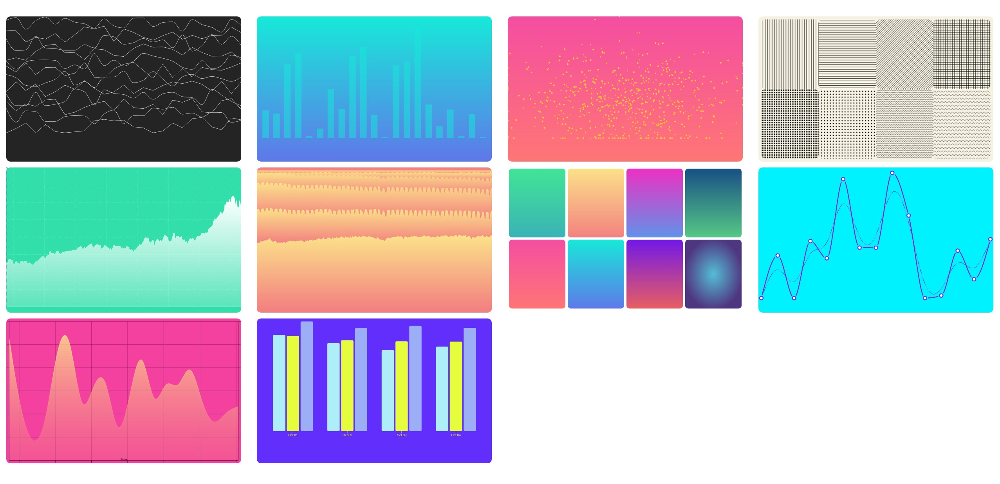

<p align="center">
  
</p>


# vue-vx

This is a vue port of [vx](https://github.com/hshoff/vx/).

The screenshot above is what you will see when running `yarn run serve`.

## Run it
```bash
yarn install
yarn run serve
```
