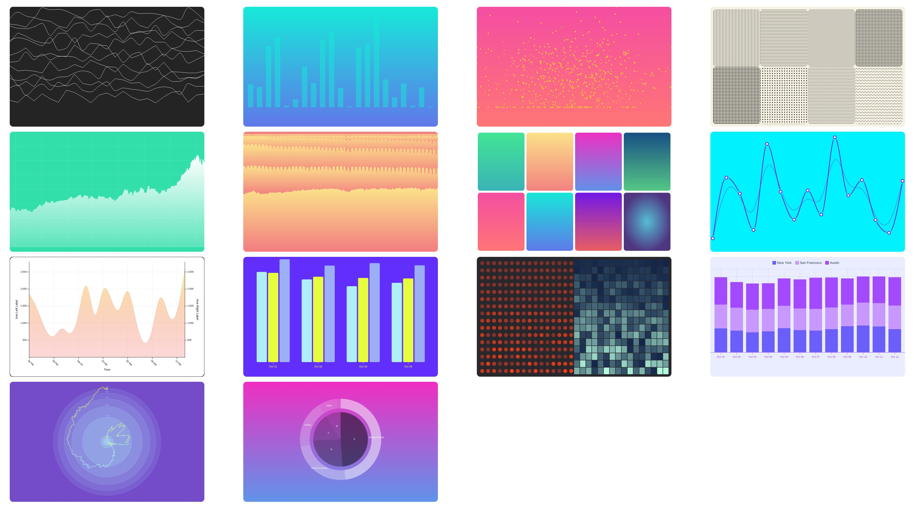

<p align="center">
  
</p>


# vue-vx

This is a vue port of [vx](https://github.com/hshoff/vx/).
It is currently in development and therefore far from usable. The demo graphs
are simply hacked into the default Vue boilerplate.

The screenshot above is what you will see when running `yarn run serve`.

## Run it
```bash
yarn install
yarn run serve
```

## Next steps

- [ ] port remaining graphs
- [ ] use mixins for commonly used properties
- [ ] bundle as library